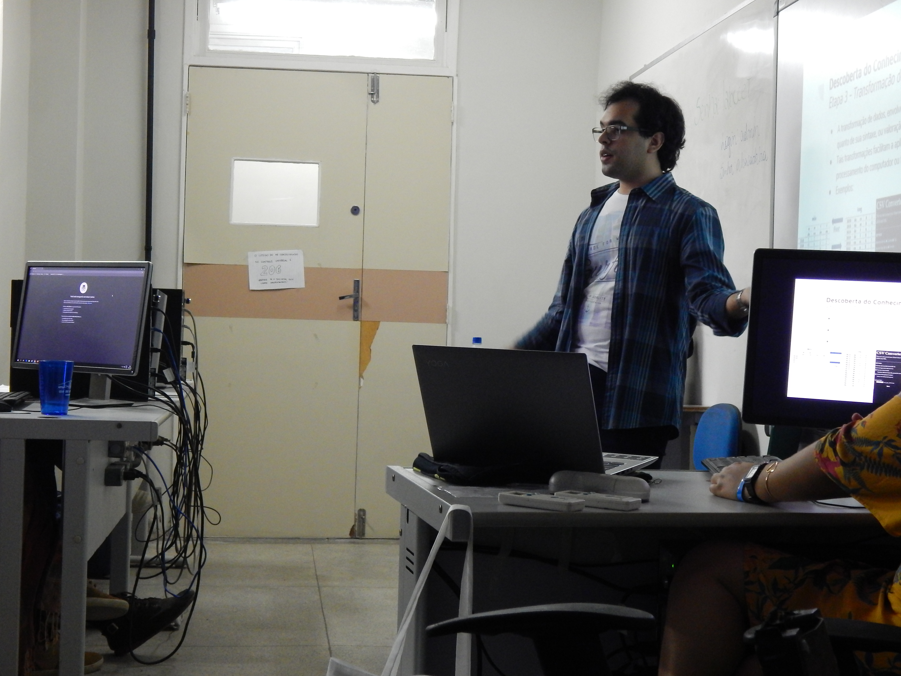
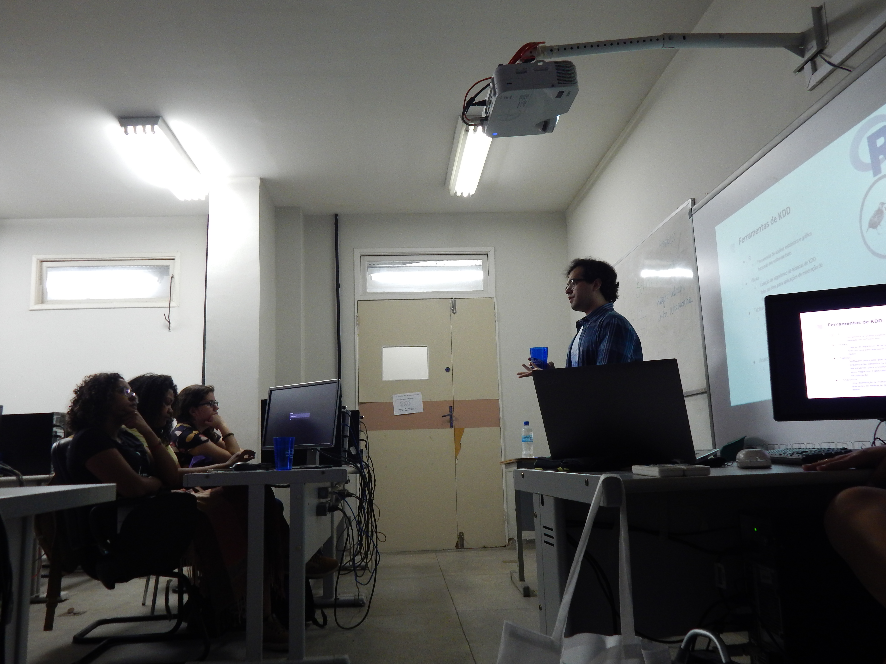
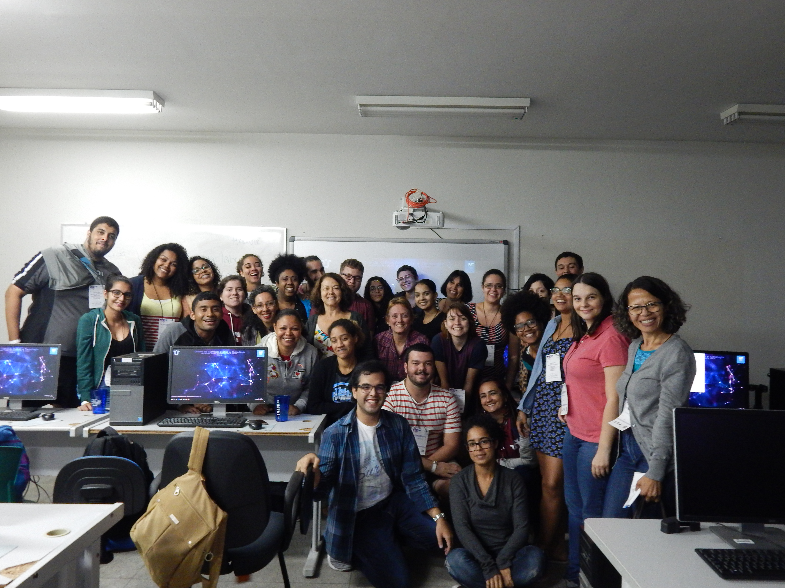

## XLI Encontro Nacional do Estudantes de Biblioteconomia, Documentação, Ciência e Gestão da Informação

Me senti muito honrado e feliz por ter sido convidado para ministrar um minicurso sobre mineração de dados para os estudantes de Biblioteconomia, Documentação, Ciência e Gestão da Informação.
O convite foi feito através da indicação da professora Dayanne da Silva Prudencio que é muito importante para mim, pois me incentiva muito, me passou grandes conhecimentos sobre ciência da informação e gestão do conhecimento em suas aulas e acredita no meu potencial. Não tenho palavras para expressar minha gratidão à ela.

Gostaria de Agradecer à comissão do XLI Encontro Nacional do Estudantes de Biblioteconomia, Documentação, Ciência e Gestão da Informação por acreditar em mim e confiar tamanha honra. Fiquei muito contente com o evento, com a turma e com os colaboradoes. Em especial fiquei muito contente com a atenção, carinho e respeito da Ingrid R. Guimarães ao longo de todo o processo do evento.

## Resumo do Curso
Esse curso tem o propósito de introduzir os alunos de Biblioteconomia, Documentação, Ciência e Gestão da Informação ao processo de KDD e tentar trazê-los mais para perto dessa área que é predominada pelo pessoal de TI e Estatística. O curso se divide em parte teórica mostrando a origem do fenômeno Big Data, o profissional que trabalha com mineração de dados atualmente, os mitos que normalmente fazem com que as pesssoas se afastem dessa área, o processo de KDD, éticas e leis sobre o uso de dados e por fim a parte prática usando o WEKA e um de seus datasets de exemplo (iris). Ao fim estão as referências utilizadas.
Ao montar os  \(Click nesse link para poder ver a apresentação\)do minicurso tentei deixar o máximo de informação possível para que possa ser sempre consultado.

## Fotos do Evento

-----------------------------

-----------------------------

-----------------------------

-----------------------------

## Contatos
* fernando.durier@hotmail.com
* fernando.durier@uniriotec.br
* fernando.durier@ibm.com

